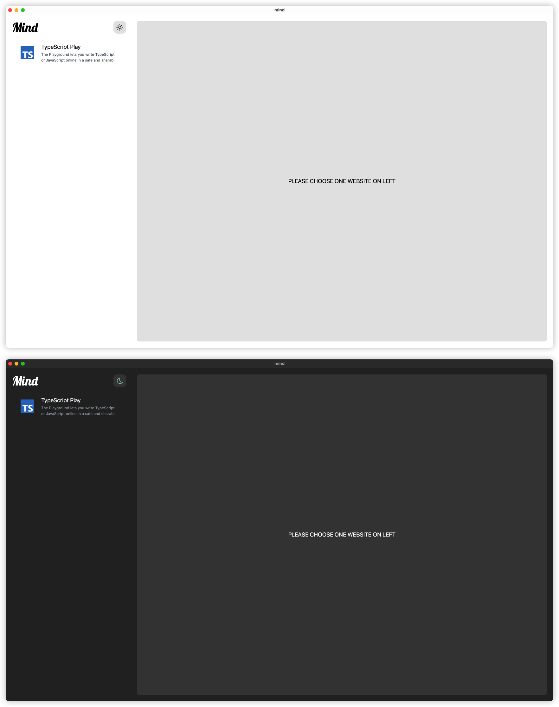
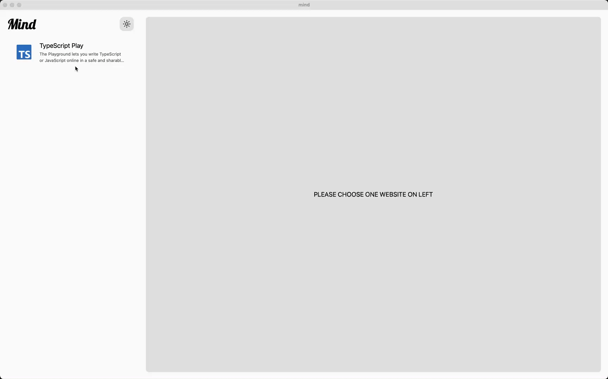

# Mind

> **Warning**
> Mind is currently under active development. If you want to use it now, please compile source code.

Clean and simple app for viewing websites.

## Why Create Mind

Sometimes I want use a website to do something(eg. Show code on Typescript Playground), but browser has too many things(eg. Tabs, Bookmarks), not clean enough. So I create Mind. Clean, simple, easy to use.

## Preview(Alpha)

### Out-of-box dark/light mode

### Open website

## Under the hood

- [Tauri](https://github.com/tauri-apps/tauri)
- [Solid-JS](https://github.com/solidjs/solid)
- [UnoCSS](https://github.com/unocss/unocss)
- [Vite](https://github.com/vitejs/vite)
- [Colid](https://github.com/alexzhang1030/colid)
